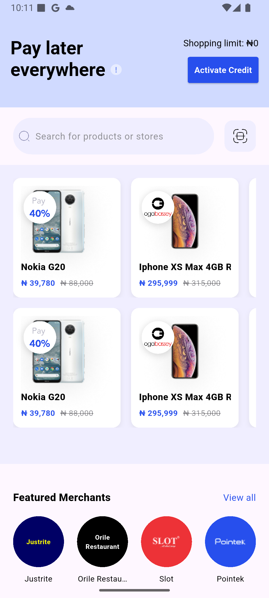
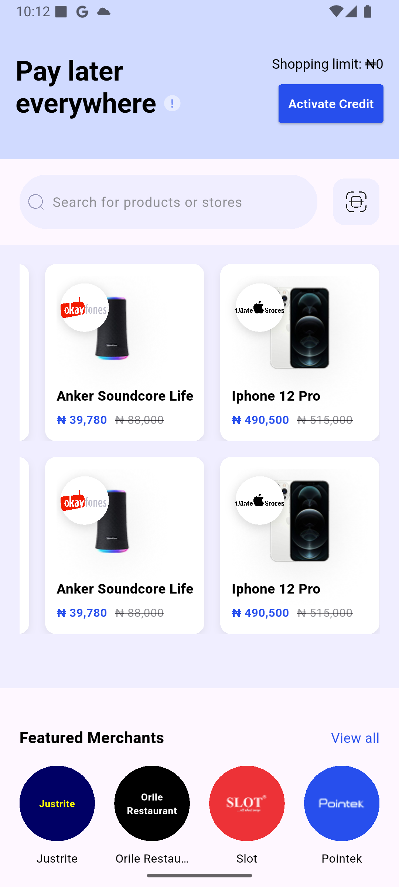
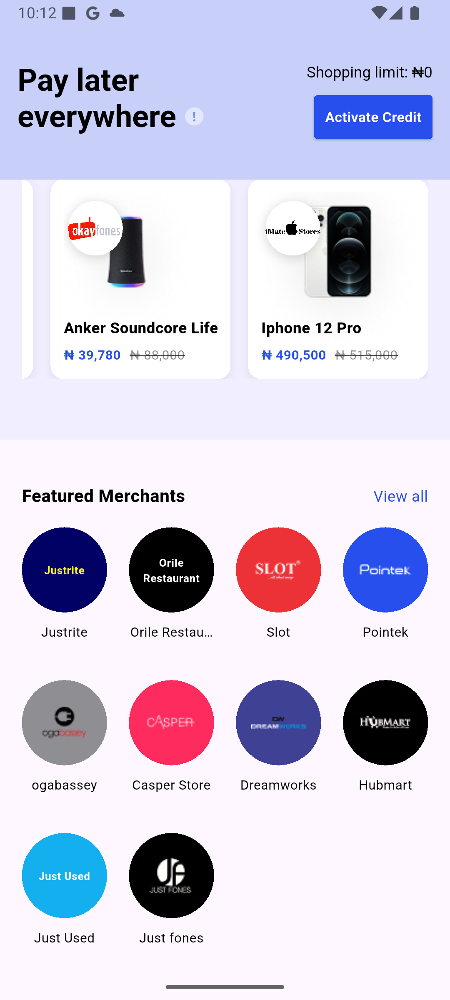
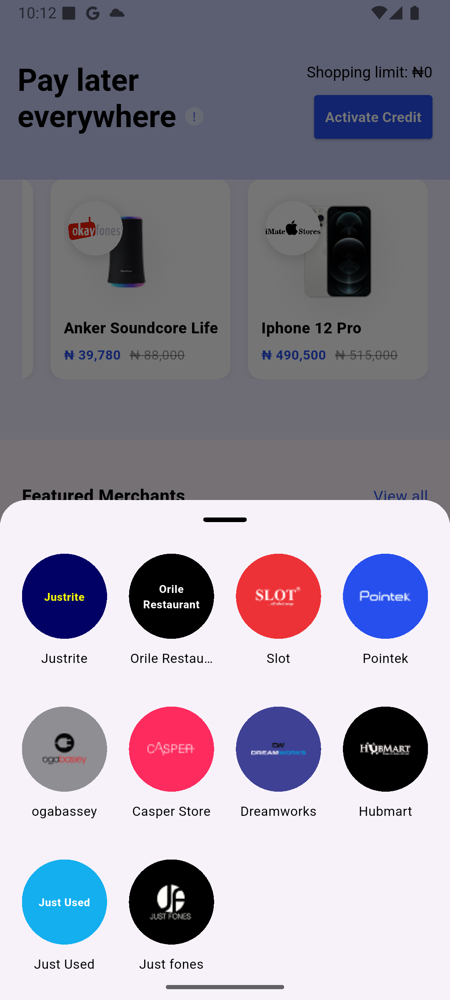
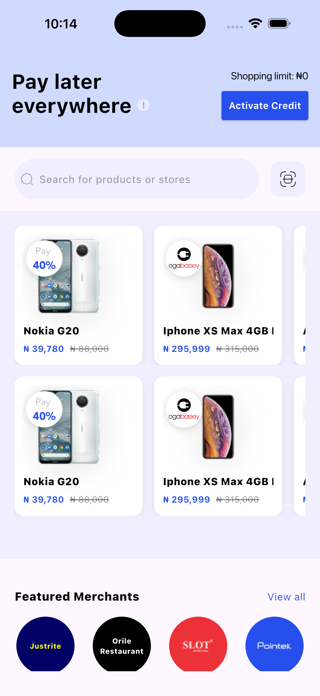
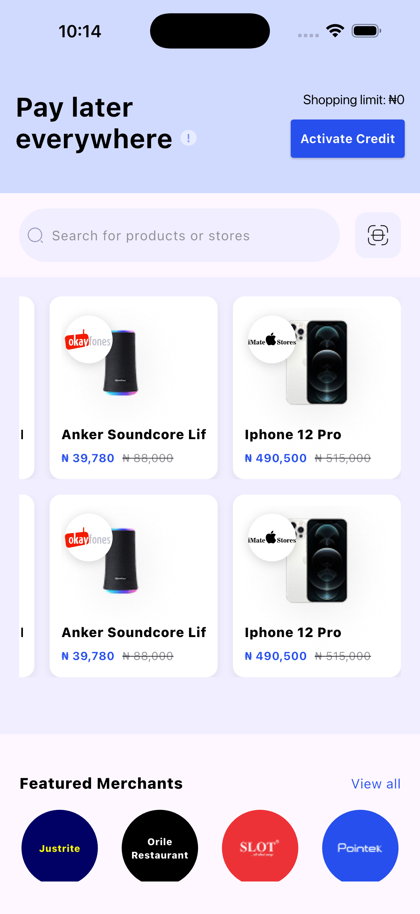
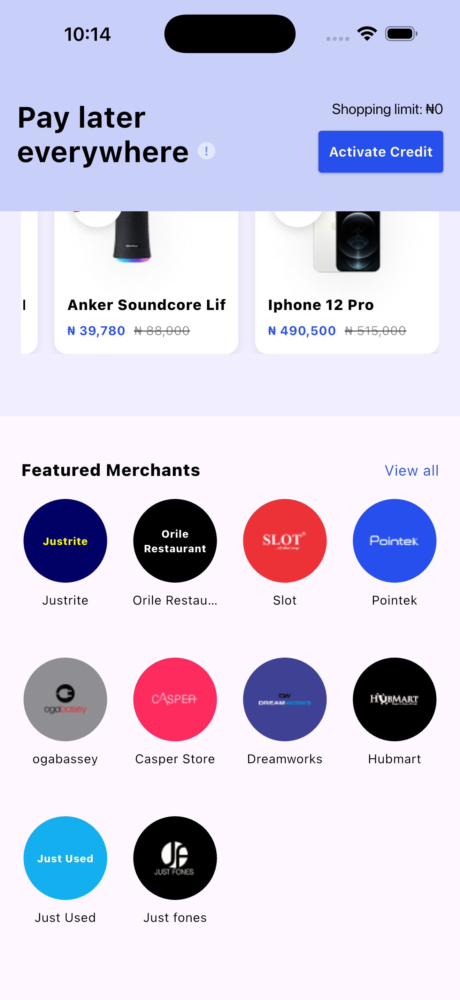
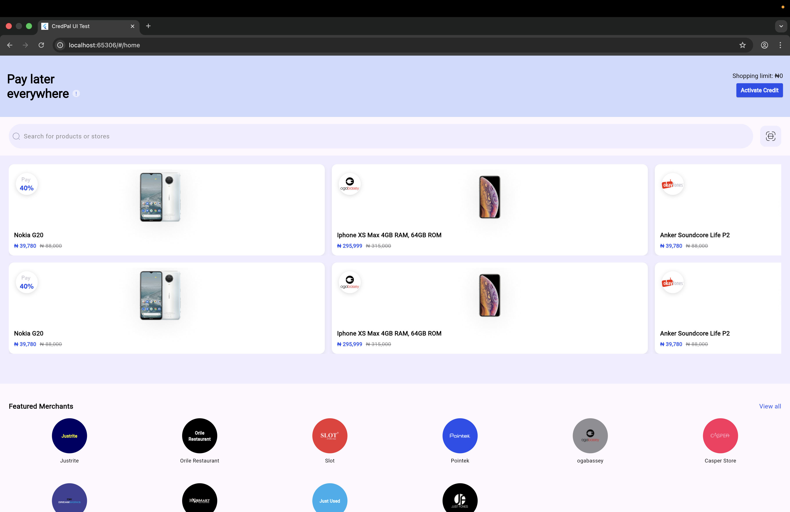
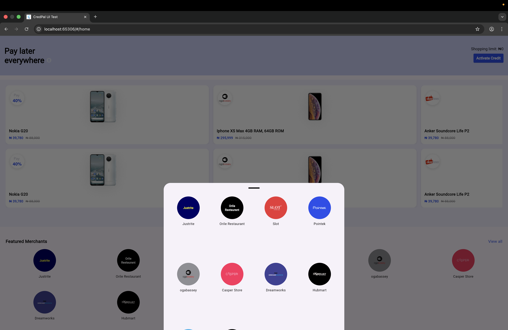
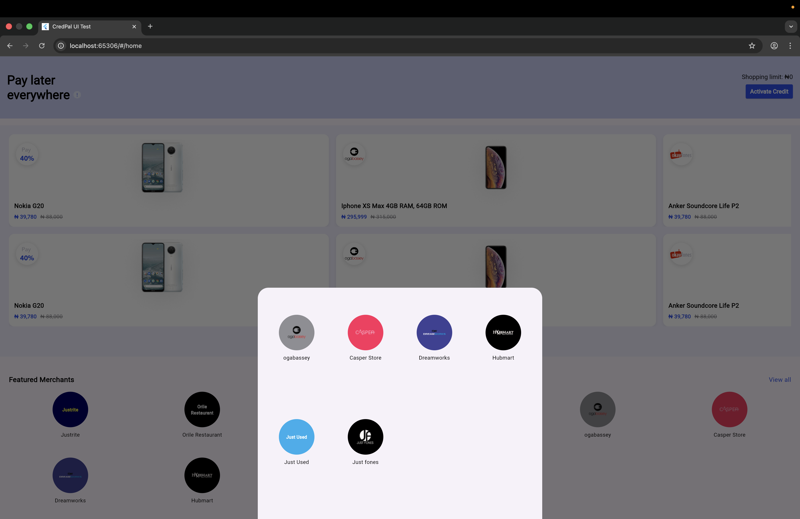

## CredPal UI Assessment (Flutter)
A Flutter implementation of the provided CredPal UI design, built as part of the Mobile App Developer technical assessment.
This project focuses on pixel accurate UI implementation, clean structure, and best Flutter practices based on the supplied Figma design.

## 📱 Supported Platforms
✅ Android
✅ iOS
✅ Web
Note: The application is designed for portrait orientation only, as the provided Figma design is portrait-specific.

## 🧠 Architectural Notes
No state management library (Bloc, Provider, etc.) was used.
The assessment does not involve APIs or dynamic business logic.
Products and merchants are stored locally as mock data.
UI components are broken down into small, reusable widgets for clarity and maintainability.
This approach keeps the implementation simple, readable, and focused on UI execution, as required by the assessment.

## 🎨 Design Implementation
All spacing, typography, colors, and layout decisions were derived directly from the Figma design.
SVG and image assets are used where available.
For logos that could not be exported from Figma, a text-based fallback was implemented to maintain layout consistency.

## 🚀 How to Run the Project
Prerequisites
- Flutter SDK (stable channel)
- Android Studio / Xcode / VS Code

### Installation
1. Clone the repository
```bash
git https://github.com/Olamidotune/credpal_ui_test.git
```
2. Navigate to project directory
```bash
cd credpal_ui_test
```
3. Install dependencies
```bash
flutter pub get
```
4. Run the app
```bash
flutter run
```
## Running on Web
```bash
flutter run -d chrome
```

## 📦 Deliverables Included
✅ GitHub repository with progressive commits
✅ Screenshots of the finished UI
✅ Web build / APK (attached separately)


## 📌 Assumptions Made
The app is portrait-only based on the provided design.
Static data was used as no API endpoints were provided.
Scroll behaviors were inferred where not explicitly defined in Figma.


## 📸 Screenshots
### Android
| Home | Products | Merchants |
|------|-----------|----------|
|  |  |  |  |

### iOS
| Home | Products | Merchants |
|------|-----------|----------|
|  |  |  |  |

## Web
| Home | Products | Merchants |
|------|-----------|----------|
|  |  |  |


## 🧱 Project Structure
The project follows a simple and scalable structure:

lib/
├── core/
│   └── constants/
│       ├── app_colors.dart
│       ├── app_spacing.dart
│       └── text_styles.dart
├── data/
│     ├──merchant_list.dart
|     └──product_list.dart
|
├── models/
│     ├──merchant.dart
|     └──product.dart
|
├── presentation/
│    ├── screens/
│    |   └── home.dart
│    └── widgets/
│
└── main.dart

## 👨🏾‍💻 Author
Egundeyi Oladotun David
Flutter Mobile Developer